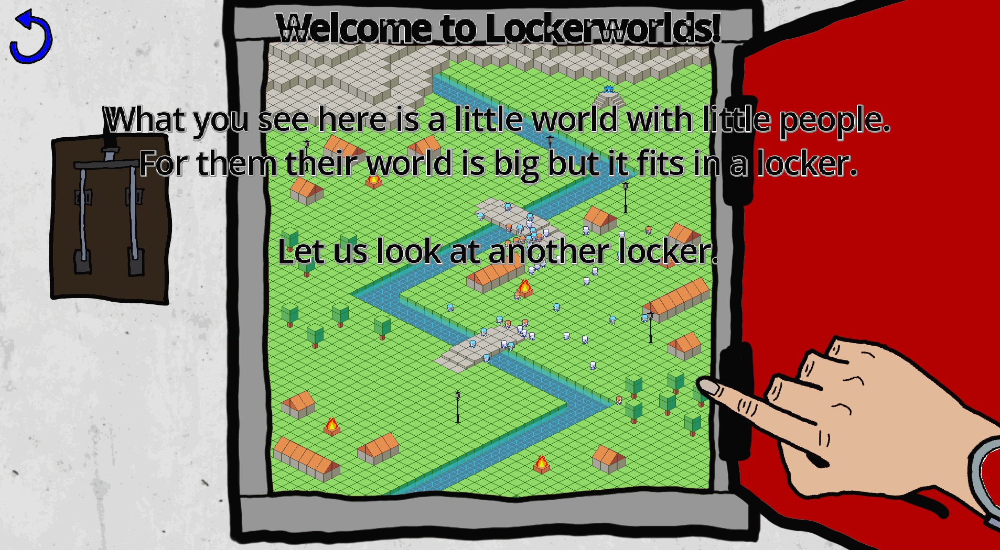
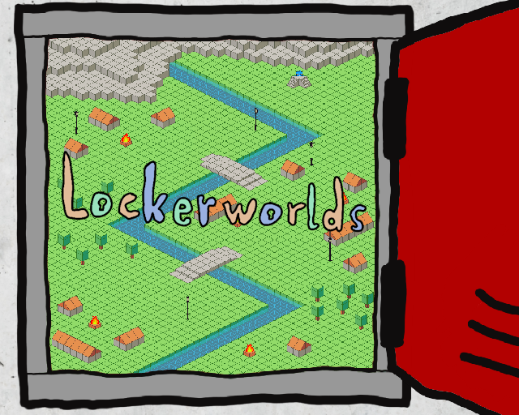

# Lockerworld

## Info

Lockerworld is a game developed for the Ludum Dare 56 Game Jam with the topic Tiny Creatures in a timespan of 72 hours.

We were inspired a scene in the movie "Men in Black 2" to create a god-simulator type game where you work at a facility where you have to take care of tiny creatures living in lockers. Make sure the lockerlings don't drown, set things on fire or become electricuted while reading a book. And beware of Godotzilla!

The game was developed in the Godot Game Engine.

## Controls

The game is controlled with the mouse.

## License

The source code of the game is published under the GPL v3 License.

## Attributions

Animated Fire by Nicole Marie T
“32x32 pixel bubbles sprites” by kia.itch.io
“Isometric Tiles Template for 32x32 pixel art” by route1rodent.itch.io
“Small 8-direction Characters” by axulart.itch.io
“Lightning VFX Free Pack” by govfx.itch.io

## Links

[Cradac on Mastodon](https://dice.camp/@cradac)

[Cybermuell on Mastodon](https://frameperfect.space/@cybermuell)

[DorianSnowball on Mastodon](https://frameperfect.space/@DorianSnowball)
